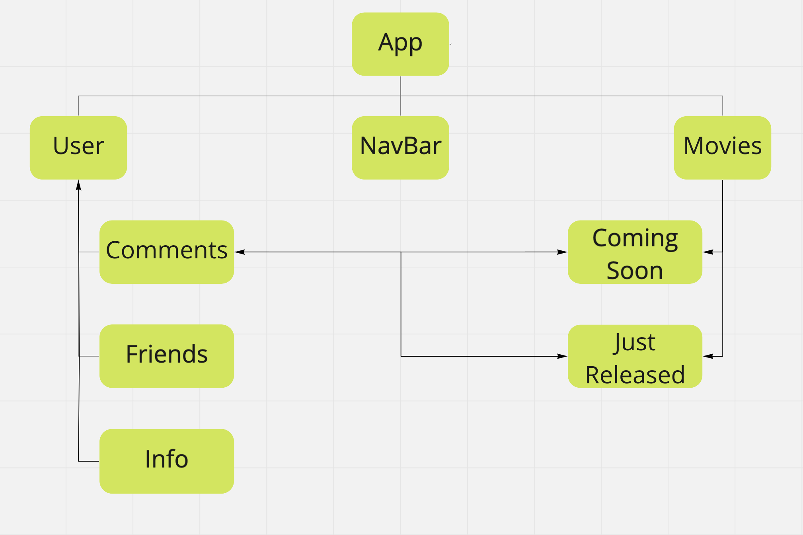
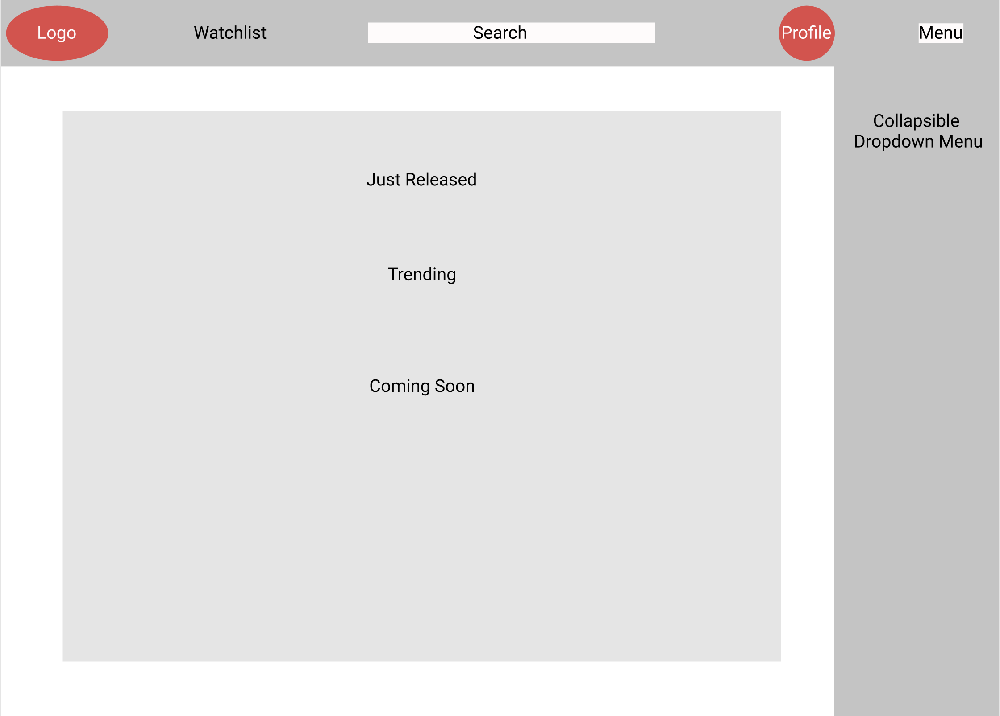

# MovieThon
A social media site built around those movies we just seen, we're extremely excited about, & need to talk to other with the same excitement. Here users can find movies in these 3 categories:
1) Just Released
2) In Theaters
3) Trending

## Technology Used
Django, HTML, Bootstrap, PostgreSQL, Netlify, & TMDB API

#### API
You can find the TMDB API [here](https://www.themoviedb.org/documentation/api)

## Getting Started/Installation Instructions
If you want to install this repo:
 1) Be sure to Fork this repo first. Forking it allows you to have a duplicate repo in your main github account. 
 2) On your Forked repo, hit the Code button (big green button) & copy the HTTPS link.
 3) Once you have the linked copied, go to your terminal and run "git clone (your copied link)" & this creates a copy of this repo's files to your local machine. 
 4) Afterwards, open the folder with the files in you preferred IDE

### Contribution Guidelines
If you want to contribute to this application, be sure to work on it from you forked repo & add your desired features. Once you've added your features, go to your repo on your GitHub, then submit a pull request.

## MovieThon Overview
### Project Description
This project must meet 4 technical requirements:
1) A complete product
2) Implement thoughtful user stories
3) Deployed online
4) Use something new I haven't learned

### User Stories
As a user, I will be greeted with a small animation that leads to the I will arrive at a home screen that will provide two options:
1) Login to an existing account
2) Signup for a new account to experience the wonder of MovieThon

Once logged in, users will reach the main page which will have the three categories of movies in a row. There will be a navbar that have the user's watchlist, a search, a profile picture, & a menu button. A visual of the main page is provided below.

### MVP Goals
In order to achieve what is considered a minimal viable product (MVP), I would need to achieve four things:
1) Fetch from the appropriate API endpoints & have those endpoints render the data on the app.
2) The user must have the ability to create an account & login when they want.
3) The user must be able to leave a comment on a desired movie & with the ability for other users to view
4) Minimal styling

### Stretch Goals
1) Search bar functionality in the Navbar
2) Watchlist functionality in the Navbar
3) Users editing their profile
4) Users following other users

### Component Hierarchy 

### Low-Fidelity Wireframes
